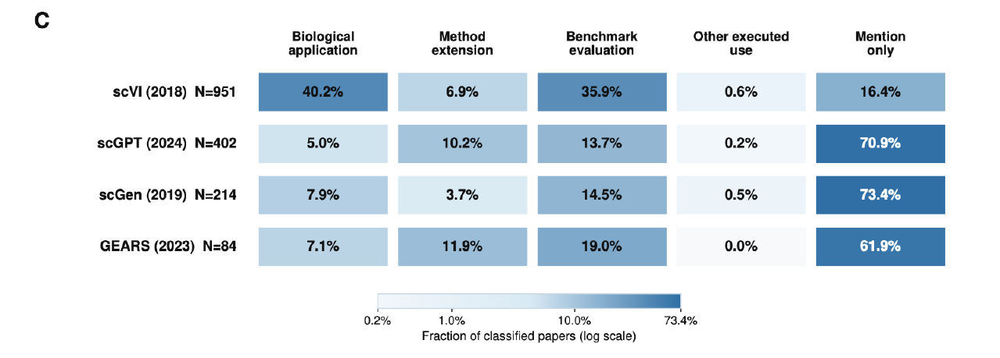

# The first comparison

Among papers with resolved classifications, biological application was much more common for scVI. For scGPT, scGen and GEARS, mention only was the most common primary category.

This is a snapshot from Figure 2 of the September 2026 manuscript draft. The figure and the values below were taken from PDF page 16 of `revision_1_0904 (1).pdf`. They have not been recomputed from the underlying study-level records.

## What is being counted?

The figure assigns each classified study one **primary category**. The reusable workflow also keeps non-exclusive use labels, but those are a different summary. A paper whose primary category is biological application can still include benchmarking or method development.

| Method | Candidate records | LLM reviewed | Classified studies |
| --- | ---: | ---: | ---: |
| scVI | 2,382 | 1,634 | 951 |
| scGPT | 1,291 | 726 | 402 |
| scGen | 582 | 274 | 214 |
| GEARS | 353 | 100 | 84 |

Panel C uses the **classified-studies column** as its denominator. Coverage differs across methods. Missing or unresolved papers are not mention-only papers, and these fractions should not be read as rates among all citations or all real-world users.

| Method | Biological application | Method extension | Benchmark evaluation | Other executed use | Mention only |
| --- | ---: | ---: | ---: | ---: | ---: |
| scVI | 40.2% | 6.9% | 35.9% | 0.6% | 16.4% |
| scGPT | 5.0% | 10.2% | 13.7% | 0.2% | 70.9% |
| scGen | 7.9% | 3.7% | 14.5% | 0.5% | 73.4% |
| GEARS | 7.1% | 11.9% | 19.0% | 0.0% | 61.9% |

Values are rounded as displayed in the source; a row can sum to 99.9%. The biological-application column does not by itself measure validated biological discoveries.

[Download the transcribed category and funnel data](figure_2_primary_categories.csv)

## How well did the human check agree?

For each evaluated method, two blinded human reviewers independently assessed 50 sampled studies and resolved disagreements by consensus. Panel D evaluates the subset with resolved machine classifications: 39 scVI studies and 40 scGPT studies. It reports **primary-category** precision and recall, not validation of every non-exclusive use label. GEARS and scGen human-validation results are not shown in this figure.

| Primary category | scVI precision / recall | scGPT precision / recall |
| --- | ---: | ---: |
| Macro average | 79.3% / 77.5% | 69.4% / 71.4% |
| Biological application | 88.9% / 80.0% | 44.4% / 100.0% |
| Method extension | 50.0% / 50.0% | 33.3% / 40.0% |
| Benchmark evaluation | 88.9% / 80.0% | 100.0% / 45.5% |
| Mention only | 89.5% / 100.0% | 100.0% / 100.0% |

Agreement varies by category. In particular, the biological-application precision for scGPT means that its machine-assigned applications need careful checking. These sample metrics do not directly supply a correction factor or uncertainty interval for the full corpus.

[Download the transcribed validation data](figure_2_human_validation.csv) · [Human-review procedure](../human_reviewers/README.md)

## Original figure and provenance

[Open the complete Figure 2](../site/assets/figure-2.png) · [Source and extraction record](provenance.json)

The complete figure retains the workflow, screening funnel, primary-category comparison and human-validation panels. The website uses only Panel C to keep the story brief; its caption links back here so the denominator and validation context remain available.

The manuscript PDF itself is not redistributed here. This folder contains the selected figure and a transcription of the displayed aggregates. It does not contain the complete production corpus, row-level classifications, sampling probabilities or final consensus tables needed to independently reproduce the study estimates.
